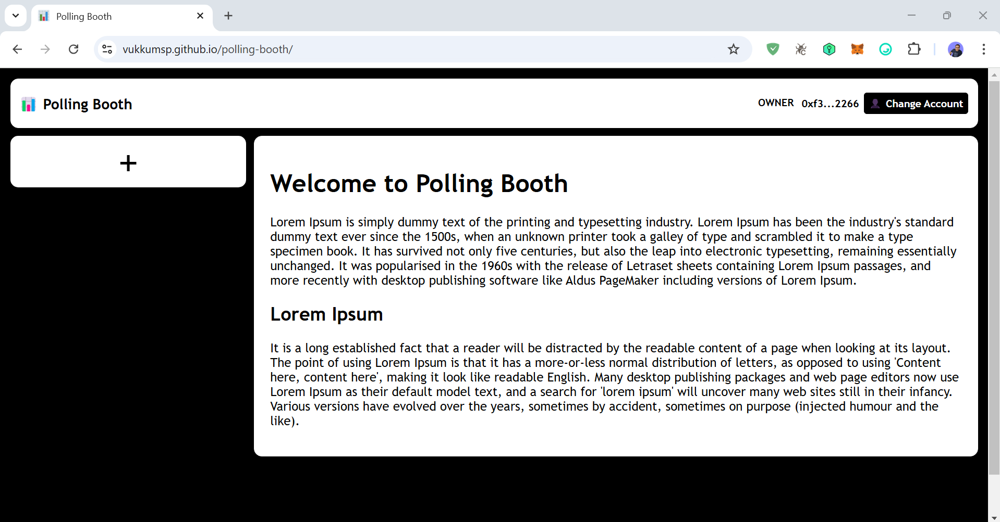
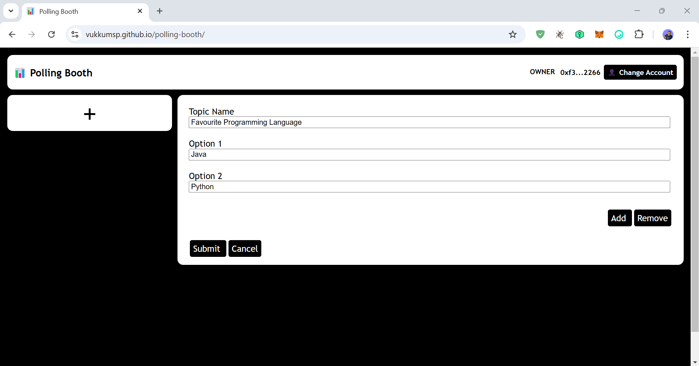
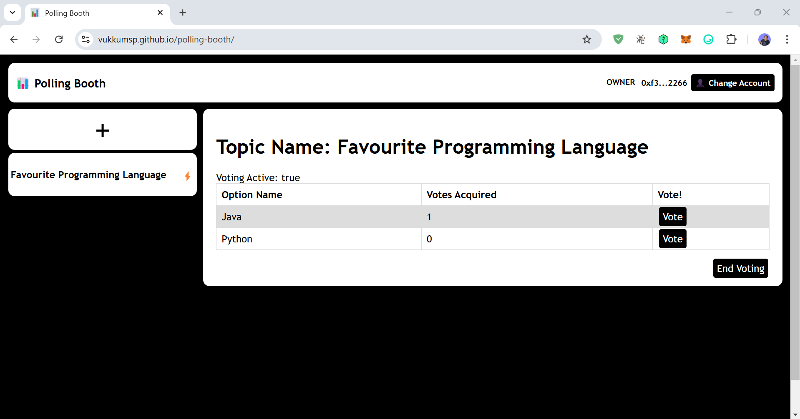
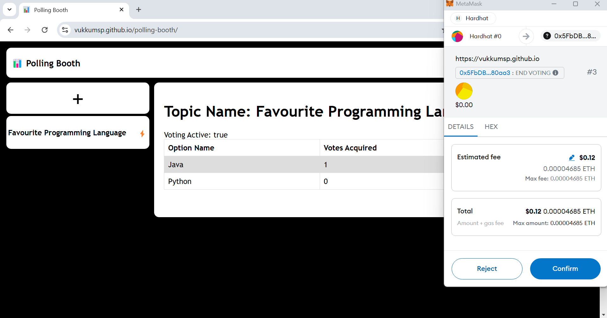
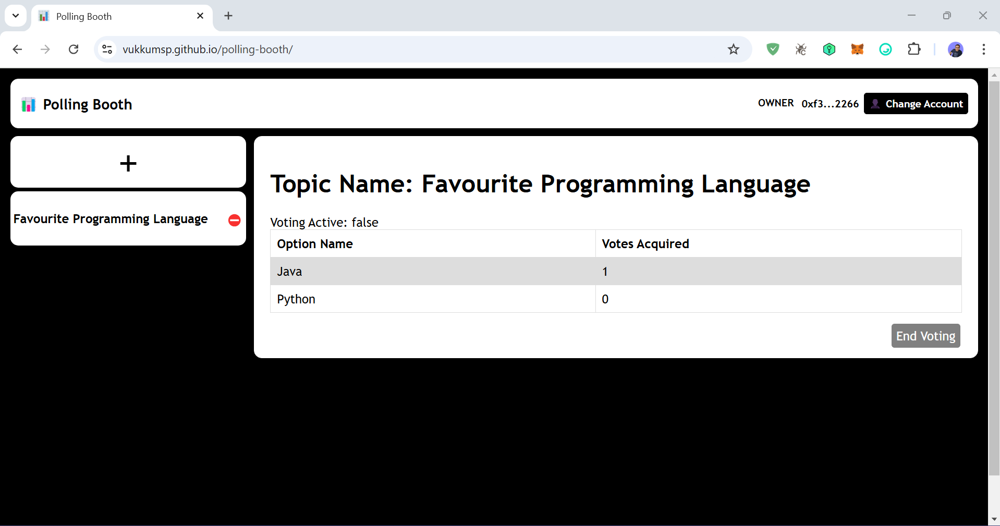

# Polling Booth

## Why this project is created ?

It is to demonstrate the use of Blockchain to track voting or polling on topics by users.

## Development

It is designed to work with a contract deployed on sepolia testnet. But, if we clone/download the repo we can change the contract and endpoint address to point it to your local blockchain or any other blockchain.

The Blockchain contract required to work with this dapp is at: https://github.com/vukkumsp/polling-booth-smart-contract

## Distribution

It is available at: https://vukkumsp.github.io/polling-booth

## How to use the App ?

<b>OWNER:</b>
As of now, only the owner of the contract can create or End Voting Events and everyone else can only vote for the same.
To become Owner, you need to deploy the polling-booth-smart-contract onto your prefered blockchain network and point this app to that network. Then the account used to deploy the polling-booth-smart-contract becomes the Owner.

<b>USER:</b>
All non owner accounts on network are treated as role User. They can vote on active voting events created by Owner.

<b>GUEST:</b>
Any non connected to wallet scenarios are treated as role Guest, they can only view the details of polling-booth but can't do any write transactions.

## Resources & Knowledge

Deployment of this new angular app is different from versions before v17, details about that is provided [here](./deployment-steps.txt)

## Preview / Screenshots of DApp
### Desktop View:
Home Page:

New voting event being created by Owner:

New voting event (active):

A Writable transaction progress using metamask wallet:

New voting event is ended(inactive):

## Notes:

This project was generated with [Angular CLI](https://github.com/angular/angular-cli) version 18.0.7.

Deployed using [angular-cli-ghpages](https://www.npmjs.com/package/angular-cli-ghpages) v2.0.3.
    
Deployment steps are present at [deployment-steps.txt](./deployment-steps.txt)